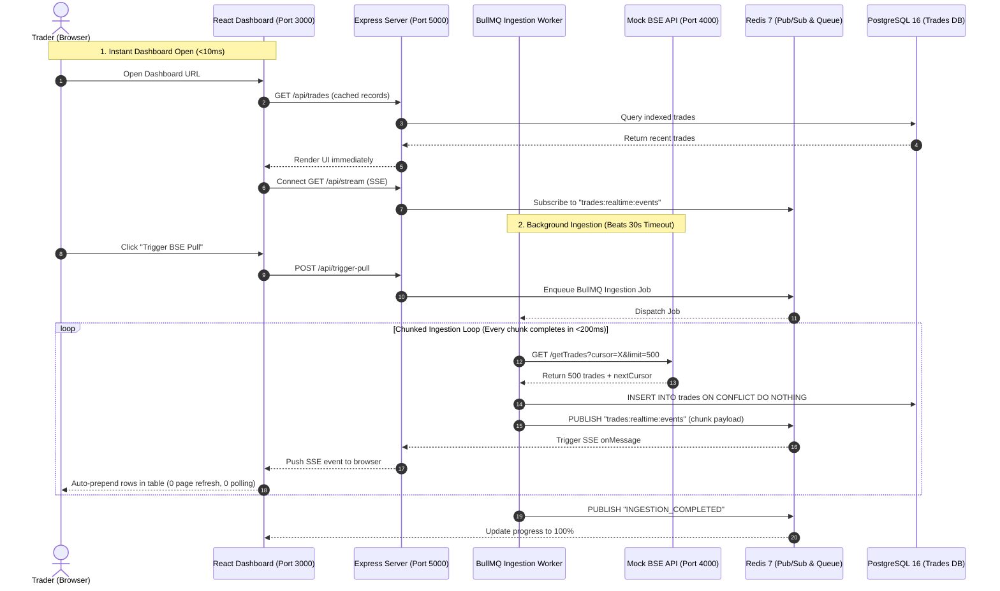

# Architecture Defense & Technical Documentation

## 1. System Architecture Diagram

---

## 2. Engineering Decisions Explained

### Why Chunked Cursor Ingestion Over Long-Polling?
- **30-Second Drop Rule**: A single HTTP connection streaming for 15 minutes is guaranteed to be terminated by load balancers or intermediate firewalls.
- **Cursor Tokens**: By breaking the 10,000-trade dataset into discrete 500-record chunks, each HTTP transaction completes in under 200 milliseconds. If a network hiccup occurs, BullMQ automatically retries the exact failing cursor chunk without losing progress.

### Why Server-Sent Events (SSE) Over Polling?
- **Zero Network Waste**: Polling loops (`setInterval` calling `/trades` every 2s) flood the server with redundant requests when no new data exists.
- **Push-based**: SSE maintains a lightweight, unidirectional connection where the server pushes only when Redis Pub/Sub receives a newly committed batch from the worker.
