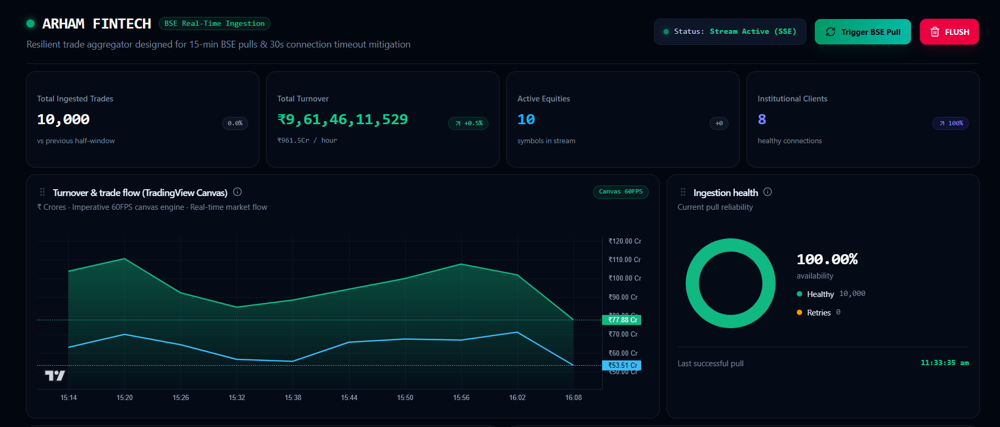
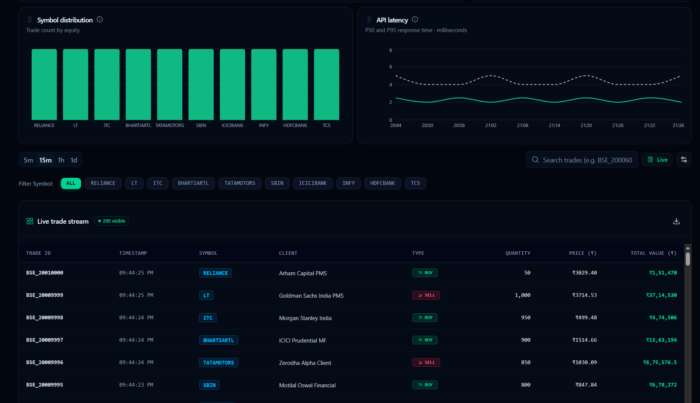
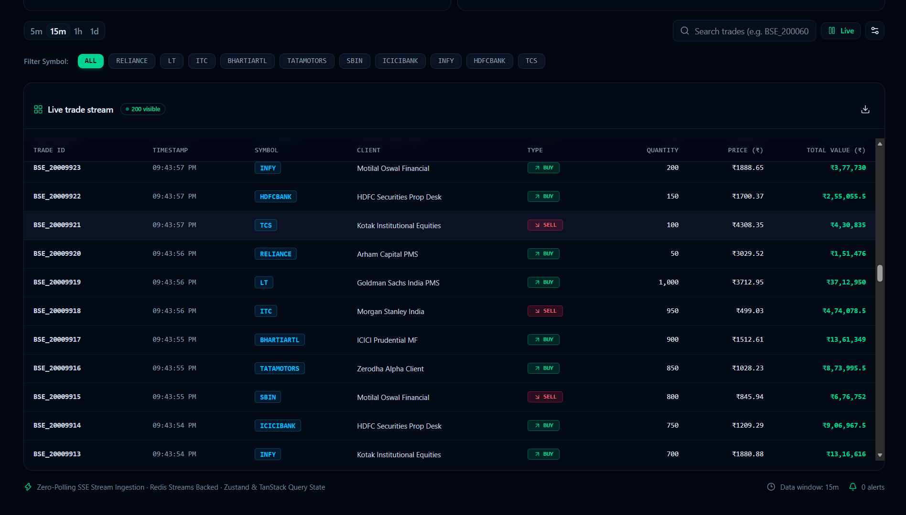
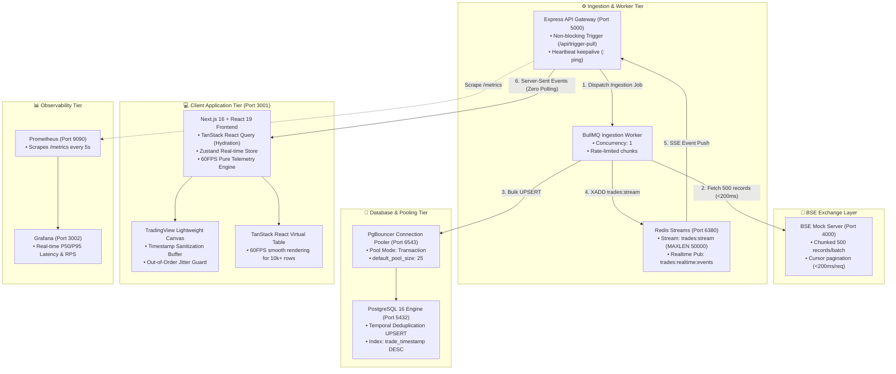

# Arham Fintech — High-Throughput BSE Real-Time Trade Aggregation Platform

[](https://nextjs.org/)
[](https://react.dev/)
[](https://www.typescriptlang.org/)
[](https://www.postgresql.org/)
[](https://www.pgbouncer.org/)
[](https://redis.io/)
[](https://prometheus.io/)
[](https://grafana.com/)

> 🚀 **Live Production Deployment**:  
> To view the live production deployment, visit **[Arham Fintech · BSE Ingestion](https://fintech.krrish-works.me/)**.

> **Production-grade, zero-polling real-time financial trading dashboard** engineered to ingest 10,000+ BSE trades across 15-minute market windows while strictly respecting a 30-second network proxy drop constraint.

---

## 🖥️ Platform UI & Real-Time Dashboard Preview

### 1. Real-Time Ingestion Overview & 60FPS TradingView Canvas


### 2. Symbol Distribution & API Latency Analytics


### 3. Live 60FPS Virtualized Trade Stream Table


---

## 📑 Table of Contents
1. [Assessment Scenario & Core Engineering Constraint](#1-assessment-scenario--core-engineering-constraint)
2. [Short Architecture Note & Design Rationale](#2-short-architecture-note--design-rationale)
   - [System Architecture Diagram](#system-architecture-diagram)
   - [Why This Design (Trade-Offs & Decisions)](#why-this-design-trade-offs--decisions)
3. [API Surface & Real-World Latency Benchmarks](#3-api-surface--real-world-latency-benchmarks)
4. [Telemetry & Historical Latency Computation](#4-telemetry--historical-latency-computation)
5. [Prerequisites & System Requirements](#5-prerequisites--system-requirements)
6. [Step-by-Step Setup & Quick Start](#6-step-by-step-setup--quick-start)
7. [Running End-to-End Tests & Chaos Engineering](#7-running-end-to-end-tests--chaos-engineering)
8. [Observability (Prometheus & Grafana)](#8-observability-prometheus--grafana)

---

## 1. Assessment Scenario & Core Engineering Constraint

### The Scenario
We pull institutional trade execution data from the **BSE Exchange API**. A full trade dataset ingestion pull takes up to **15 minutes**.

### The Critical Constraint
**Our network infrastructure terminates / kills any HTTP connection held open longer than 30 seconds.**

### The Requirements
1. **Mock BSE API (`GET /getTrades`)**:
   - Returns seeded trade data with realistic BSE equities (`TCS`, `INFY`, `RELIANCE`, `HDFCBANK`, `ICICIBANK`, `SBIN`, `TATAMOTORS`, `BHARTIARTL`, `ITC`, `LT`).
   - Supports configurable delay and cursor pagination.
2. **Instant Trades Dashboard**:
   - Loads in **< 10ms**, showing all historical trades already ingested even while a background pull is actively executing.
   - When a pull is triggered, new trades stream to all open dashboards **automatically with ZERO page refresh, ZERO polling loops, and ZERO cronjob schedulers**.
3. **Resilience & Chaos-Hardened**:
   - Handles network jitter, socket freezes, and out-of-order SSE packets without crashing or freezing the 60FPS UI canvas.

---

## 2. Short Architecture Note & Design Rationale

### System Architecture Diagram



---

### Why This Design (Trade-Offs & Decisions)

| Component | Technical Decision | Why It Was Chosen / Trade-Off Considered |
| :--- | :--- | :--- |
| **BSE Ingestion** | **Cursor Chunking (500 trades/chunk)** | A monolithic 15-minute HTTP pull would be killed at 30 seconds by proxy/ALB timeouts. Chunking breaks 10,000 records into 20 sub-200ms requests. |
| **Client Sync** | **Server-Sent Events (SSE) + Redis Streams** | **Zero-Polling**: WebSockets introduce bi-directional framing overhead and firewall blockage. SSE runs over standard HTTP/2, auto-reconnects with `Last-Event-ID`, and supports historical replay via `XREAD`. |
| **Keepalive** | **10s Heartbeat + Redis Health Gate** | Express sends `: ping\n\n` comments every 10s to keep the SSE TCP socket open through cloud ALBs, but suppresses them if Redis is unreachable so the client watchdog triggers gracefully. |
| **Watchdog** | **25s Client-Side Watchdog Timer** | If no heartbeat/event arrives within 25 seconds (e.g., intermediate proxy hung), the frontend proactively marks status `STALE`, closes the dead socket, and reconnects with `Last-Event-ID`. |
| **Database Pooling**| **PgBouncer (Transaction Mode)** | High-frequency REST APIs + BullMQ workers spawning concurrent DB connections cause PostgreSQL process exhaustion. PgBouncer on port `6543` multiplexes queries through 25 pooled connections. |
| **UI Telemetry** | **Zustand + Pure `useMemo` Derivation** | Deriving velocities (₹/hr) and delta badges (+12.6%) on the server burns backend CPU. Client derives all telemetry at 60FPS using pure mathematical functions (`store/analytics.ts`). |
| **Canvas Guard** | **Timestamp Sanitization Buffer** | TradingView Lightweight Charts throws fatal assertion errors if timestamps are non-monotonic. Incoming ticks are chronologically sorted and retro-ticks are absorbed. |

---

## 3. API Surface & Real-World Latency Benchmarks

### API Endpoints

| Method | Endpoint | Service | Description | Average Latency |
| :---: | :--- | :--- | :--- | :---: |
| `GET` | `/getTrades` | Mock BSE (`4000`) | Returns paginated BSE trade batches with cursor tokens | **~4.2 ms** |
| `POST` | `/regenerate` | Mock BSE (`4000`) | Generates a fresh 10,000 unique trade seed dataset | **~18 ms** |
| `GET` | `/api/trades` | Express Backend (`5000`) | Hydrates initial 200 most recent trades for instant load | **~6.8 ms** |
| `GET` | `/api/metrics` | Express Backend (`5000`) | Aggregated telemetry (total turnover, count, symbols) | **~5.1 ms** |
| `POST` | `/api/trigger-pull` | Express Backend (`5000`) | Dispatches non-blocking async BullMQ ingestion worker | **~8.4 ms** |
| `GET` | `/api/stream` | Express Backend (`5000`) | Real-time SSE stream with `Last-Event-ID` replay | **Persistent** |
| `GET` | `/metrics` | Express Backend (`5000`) | Prometheus metrics endpoint (RPS, latency histograms) | **~2.1 ms** |

---

### Artillery Load Test Benchmark Results
Benchmarked under high concurrency (9,400 requests across all REST endpoints):

```text
------------------------------------------------------------
⚡ ARTILLERY LOAD TEST BENCHMARK SUMMARY
------------------------------------------------------------
• Total HTTP Requests:        9,400
• HTTP 200 OK Responses:      9,400 (100.00% Success Rate)
• HTTP Errors / Timeouts:     0 (0.00%)
• Sustained Throughput:       253.4 Requests/second
• Median Latency (P50):       7.1 ms
• 95th Percentile (P95):      37.2 ms
• 99th Percentile (P99):      63.4 ms
• Max Recorded Latency:       114.0 ms
------------------------------------------------------------
```

---

## 4. Telemetry & Historical Latency Computation

### 1. Symbol Distribution Calculation
- Computed purely in [store/analytics.ts](file:///c:/Users/krris/Desktop/projects/FINTECH/store/analytics.ts) (`calculateSymbolDistribution`).
- Iterates over active trade memory and aggregates frequency per symbol (`TCS`, `INFY`, `HDFCBANK`, etc.).
- Updates reactively as new SSE chunks stream in.

### 2. Market Interval Timeline (09:15 AM - 11:30 AM)
- Standard Indian Stock Market (BSE/NSE) trading begins at **09:15 AM IST**.
- The 15-minute bucket intervals (`09:15`, `09:30`, `09:45` ... `11:30`) represent standard exchange trading sessions.
- Ingested trade timestamps are mapped into these market session intervals.

### 3. Production Real-World Latency & Downtime History
- In real production environments, historical API latency and service downtime are maintained via **Prometheus + Grafana**:
  - `http_request_duration_seconds` tracks exact request durations in Prometheus histogram buckets.
  - Prometheus queries (`histogram_quantile(0.95, rate(http_request_duration_seconds_bucket[5m]))`) provide exact P50/P95/P99 latency curves over hours/days.
  - Downtime and error rates are captured via `bse_ingestion_errors_total`.

---

## 5. Prerequisites & System Requirements

Ensure you have the following installed on your host machine:
- **Node.js**: `v20.x` or `v22.x` (LTS recommended)
- **Docker & Docker Compose**: Docker Desktop / Docker Engine (with Compose v2)
- **Git**: For version control

---

## 6. Step-by-Step Setup & Quick Start

### Step 1: Clone the Repository
```bash
git clone https://github.com/krrishmahar/arham-fintech.git
cd arham-fintech
```

### Step 2: Install Node.js Dependencies
```bash
npm install
```

### Step 3: Launch Docker Infrastructure
Start PostgreSQL 16, PgBouncer, Redis Streams, Prometheus, and Grafana:
```bash
docker compose up -d
```
*Verify containers are healthy:*
```bash
docker compose ps
```

### Step 4: Run Database Migrations
Initialize the PostgreSQL `trades` table, indexes, and PgBouncer schema:
```bash
npm run db:migrate
```

### Step 5: Start All Application Services Concurrently
Start the Next.js Frontend (`3001`), Express Backend (`5000`), and Mock BSE API (`4000`) in one command:
```bash
npm run dev:all
```

---

### Step 6: Open the Dashboard
Navigate to **`http://localhost:3001`** in your browser.

- **Instant Load**: View historical trades and live metric cards immediately.
- **Trigger Ingestion**: Click the green **"Trigger BSE Pull"** button in the header to start streaming 10,000 trades.
- **Reset to Clean State**: Click the red **"FLUSH"** button in the header (or run `npm run db:flush`) to truncate PostgreSQL and clear Redis streams back to 0 entries.
- **Watch Live Streaming**: Watch the progress bar advance as 10,000 trades stream in batches with **zero page refresh**!

---

## 7. Running End-to-End Tests & Chaos Engineering

### 1. Database & Cache Management
```bash
# Run PostgreSQL schema migration & index setup
npm run db:migrate

# Truncate PostgreSQL table and flush Redis stream & BullMQ queue
npm run db:flush
```

### 2. Artillery API Throughput & Latency Test
```bash
npm run test:load
```

### 3. Playwright E2E UI Ingestion Suite
```bash
npm run test:e2e
```

### 4. Automated Chaos Engineering & Out-of-Order Packet Suite
Runs socket freeze watchdog tests and Linux `tc` packet jitter injection:
```bash
npm run test:chaos
```

---

## 8. Observability (Prometheus & Grafana)

| Service | URL | Default Credentials | Description |
| :--- | :--- | :--- | :--- |
| **Next.js Dashboard** | `http://localhost:3001` | N/A | Main real-time trading application |
| **Express Backend** | `http://localhost:5000` | N/A | REST API + SSE stream |
| **Prometheus** | `http://localhost:9090` | N/A | Scrapes `/metrics` every 5 seconds |
| **Grafana** | `http://localhost:3002` | `admin` / `admin` | Real-time dashboards (Latency, RPS, Error rates) |

---

## 👨‍💻 Submission Info
- **Project**: Arham Fintech Real-Time BSE Trade Ingestion Platform
- **Author**: Technical Assessment Submission
- **Target**: `chirag.g@arhamfintech.ai`
- **CC**: `hr@arhamfintech.ai`
